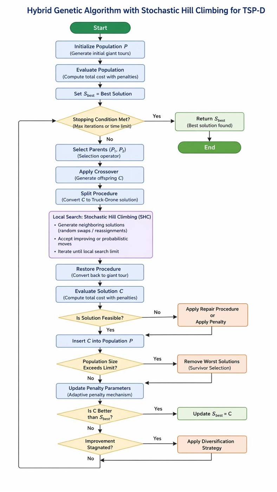

# Hybrid Truck-Drone Delivery Optimization  
## Traveling Salesman Problem with Drone (TSP-D)

This repository implements a Python-based optimization study for a hybrid truck-drone delivery system. The project focuses on the **Traveling Salesman Problem with Drone (TSP-D)**, where a truck follows the main delivery route while a drone can be launched from the truck to serve selected customers and return at a rendezvous point.

The main objective is to minimize the total operational cost of the delivery system.

---

## 1. Project Overview

The project is based on the **Hybrid Genetic Algorithm (HGA)** framework for TSP-D and extends it with **Stochastic Hill Climbing (SHC)** as a local refinement mechanism.

The implemented methods are:

| Method | Role in the Project |
|---|---|
| **HGA** | Standard Hybrid Genetic Algorithm baseline |
| **HGA-SHC** | Proposed enhanced method with stochastic local search |
| **GRASP** | Benchmark comparison algorithm |

The project compares these algorithms on generated customer node sets and evaluates them using the total cost value `Z`.

---

## 2. Problem Definition

In the TSP-D setting, the delivery system consists of:

- a depot,
- one truck,
- one drone,
- multiple customer nodes.

Each customer must be served exactly once, either by the truck or by the drone. The truck acts as the main routing vehicle, while the drone can perform selected deliveries by flying from a launch node to a customer node and returning to a rendezvous node.

This problem is more complex than the classical Traveling Salesman Problem because it requires both:

1. route optimization, and  
2. truck-drone synchronization.

---

## 3. Objective Function

The objective is to minimize the total operational cost:

```text
Total Cost = Truck Travel Cost + Drone Travel Cost + Waiting Cost
```

The cost model includes:

| Cost Component | Explanation |
|---|---|
| **Truck travel cost** | Cost of the distance traveled by the truck |
| **Drone travel cost** | Cost of the drone flight from launch to customer and then to rendezvous |
| **Waiting cost** | Synchronization penalty if the truck or drone arrives earlier and must wait |

A lower total cost indicates a better solution.

---

## 4. Constraints

The implemented model considers the main operational constraints of a truck-drone delivery system:

- every customer must be served exactly once,
- the truck must start from and return to the depot,
- the drone must not exceed its endurance limit,
- truck and drone operations must be synchronized at rendezvous points,
- route continuity must be preserved.

---

## 5. Methodology

### 5.1 Hybrid Genetic Algorithm (HGA)

The HGA creates a population of candidate routes. Each solution is represented as a **giant tour**, which is then evaluated through the `split_procedure`.

The main steps are:

1. generate an initial population,
2. select better solutions as parents,
3. apply crossover to create child solutions,
4. evaluate each child using the split procedure,
5. keep the best solutions in the population.

### 5.2 HGA with Stochastic Hill Climbing (HGA-SHC)

The proposed version improves the standard HGA by adding a stochastic local search stage.

After a new solution is generated, SHC performs random local changes. In the current implementation, this is mainly done through random swaps in the giant tour. Better solutions are accepted, and some non-improving moves may also be accepted with a small probability. This helps the algorithm reduce the risk of being trapped in local optima.

### 5.3 GRASP

GRASP stands for **Greedy Randomized Adaptive Search Procedure**. It is used as a benchmark algorithm. It builds routes by selecting from a restricted candidate list of nearby nodes and evaluates the generated routes using the same split procedure.

---

## 6. Program Flow



The program starts from `main.py`, calls the benchmark runner, generates customer nodes, computes the distance matrix, runs the three algorithms, evaluates the cost values, and prints the benchmark results.

---

## 7. Project Structure

```text
tspd-project/
│
├── README.md
├── requirements.txt
├── main.py
│
├── tspd/
│   ├── __init__.py
│   └── tspd_utils.py
│
├── solvers/
│   ├── __init__.py
│   ├── hga_solver.py
│   ├── hga_shc.py
│   └── grasp_solver.py
│
├── experiments/
│   ├── __init__.py
│   └── main_benchmark.py
│
├── data/
│   └── results.txt
│
├── docs/
│   └── Problem faced.md
│
└── notebooks/
    └── plot.ipynb
```

---

## 8. Module Descriptions

| File / Folder | Description |
|---|---|
| `main.py` | Main entry point of the project. Runs the benchmark process. |
| `experiments/main_benchmark.py` | Executes HGA, GRASP, and HGA-SHC on the same generated node sets. |
| `tspd/tspd_utils.py` | Mathematical and utility core of the project. Includes node generation, distance matrix computation, nearest-neighbor tour creation, and the split procedure. |
| `solvers/hga_solver.py` | Implements the standard Hybrid Genetic Algorithm. |
| `solvers/hga_shc.py` | Implements the enhanced HGA-SHC method with stochastic hill climbing. |
| `solvers/grasp_solver.py` | Implements the GRASP benchmark algorithm. |
| `data/results.txt` | Stores benchmark result outputs. |
| `docs/Problem faced.md` | Documents implementation challenges and design decisions. |
| `notebooks/plot.ipynb` | Used for plotting and visual analysis of benchmark results. |

---

## 9. Core Functions

| Function | Location | Purpose |
|---|---|---|
| `generate_nodes()` | `tspd/tspd_utils.py` | Generates synthetic depot and customer coordinates. |
| `compute_distance_matrix()` | `tspd/tspd_utils.py` | Computes Euclidean distances between all node pairs. |
| `get_nn_tour()` | `tspd/tspd_utils.py` | Creates a nearest-neighbor initial tour. |
| `split_procedure()` | `tspd/tspd_utils.py` | Evaluates a giant tour by considering truck-drone delivery possibilities and cost components. |
| `hga_solve()` | `solvers/hga_solver.py` | Runs the standard HGA algorithm. |
| `hga_shc_solve()` | `solvers/hga_shc.py` | Runs the enhanced HGA-SHC algorithm. |
| `grasp_solve()` | `solvers/grasp_solver.py` | Runs the GRASP benchmark algorithm. |

---

## 10. Installation

Create and activate a virtual environment:

```bash
python3 -m venv venv
source venv/bin/activate
```

For Windows:

```bash
python -m venv venv
venv\Scripts\activate
```

Install requirements:

```bash
pip install -r requirements.txt
```

---

## 11. Running the Project

Run the benchmark from the project root:

```bash
python main.py
```

This executes all three algorithms and prints the cost values for each problem size.

---

## 12. Benchmark Results

| Nodes | HGA Cost | GRASP Cost | HGA-SHC Cost |
|---:|---:|---:|---:|
| 5 | 19.83 | 19.83 | 19.83 |
| 10 | 28.49 | 28.20 | 28.49 |
| 100 | 93.53 | 260.96 | 93.03 |
| 200 | 128.45 | 516.15 | 127.75 |

The results show that HGA-SHC performs similarly to HGA on small instances and slightly improves the cost on larger instances. GRASP performs competitively on small instances but produces significantly higher costs for larger problem sizes.

---

## 13. Ablation: Effect of SHC

The ablation comparison isolates the effect of the SHC component by comparing the standard HGA with the enhanced HGA-SHC version. Both methods use the same generated node sets and the same split procedure.

| Nodes | HGA Cost | HGA-SHC Cost | Difference | Interpretation |
|---:|---:|---:|---:|---|
| 5 | 19.83 | 19.83 | 0.00 | Same result |
| 10 | 28.49 | 28.49 | 0.00 | Same result |
| 100 | 93.53 | 93.03 | 0.50 | HGA-SHC slightly better |
| 200 | 128.45 | 127.75 | 0.70 | HGA-SHC slightly better |

The improvement is relatively small, but it becomes visible as the problem size increases. This supports the idea that stochastic local search can improve the refinement capability of HGA in larger search spaces.

---

## 14. Limitations

- The current SHC implementation mainly uses random swap-based local search.
- The split procedure returns the final cost but does not output a detailed truck-drone route visualization.
- The benchmark uses synthetically generated customer coordinates.
- Runtime comparison is planned but not fully integrated as a separate analysis module.
- Additional experiments with multiple random seeds would improve robustness.

---

## 15. Future Work

Possible extensions include:

- adding a runtime comparison module,
- adding convergence graphs,
- testing multiple random seeds,
- exporting benchmark results as CSV,
- visualizing truck and drone routes separately,
- extending SHC with stronger neighborhood operators such as 2-opt, relocation, and drone-aware moves.

---

## 16. Academic Context

This project was developed for the **App Development for Optimization** course. It studies the Truck + Drone Delivery System, also known as the Traveling Salesman Problem with Drone, and evaluates HGA-based optimization methods against a GRASP benchmark.

---

## 17. Presentation Summary

This project solves a hybrid truck-drone delivery optimization problem. The objective is to minimize total operational cost, including truck travel, drone travel, and synchronization waiting costs. The project compares three methods: standard HGA, HGA with Stochastic Hill Climbing, and GRASP. The HGA-SHC method adds a stochastic local refinement step to the genetic algorithm. The benchmark results show that HGA-SHC performs similarly to HGA on small instances and slightly better on larger instances, while GRASP becomes less effective as the node size increases.

---

## 18. Fast Validation and Reproducibility Benchmark

To satisfy the benchmark testing, validation, and refinement requirements, the project includes a fast reproducibility benchmark:

```bash
python -m experiments.validation_benchmark
```

This script evaluates the three algorithms on generated TSP-D instances using fixed random seeds. It produces two output files:

```text
/data/validation_results.csv
/data/validation_summary.md
```

The validation benchmark compares:

- solution quality using best and average cost,
- runtime using average execution time,
- robustness using standard deviation across different seeds,
- improvement of the proposed HGA-SHC method against the HGA baseline.

### Validation Summary

| Customers | Algorithm | Best Cost | Avg Cost | Std Cost | Avg Runtime (s) | Improvement vs HGA (%) |
|---:|---|---:|---:|---:|---:|---:|
| 5 | HGA | 21.287 | 25.4586 | 3.8603 | 0.0014 | - |
| 5 | GRASP | 26.0316 | 27.0401 | 1.6165 | 0.0011 | - |
| 5 | HGA-SHC | 21.287 | 24.955 | 3.269 | 0.0299 | 1.98 |
| 10 | HGA | 32.6534 | 34.8621 | 2.9157 | 0.0054 | - |
| 10 | GRASP | 34.4321 | 35.4101 | 1.4762 | 0.0045 | - |
| 10 | HGA-SHC | 30.1252 | 33.6044 | 3.3839 | 0.1321 | 3.61 |
| 20 | HGA | 45.6821 | 48.3004 | 3.1415 | 0.0245 | - |
| 20 | GRASP | 48.5159 | 53.4879 | 5.6428 | 0.0179 | - |
| 20 | HGA-SHC | 44.4975 | 46.8844 | 3.7764 | 0.5934 | 2.93 |

These results show that the proposed HGA-SHC method improves the average solution cost compared with the HGA baseline on all tested generated instances. The improvement is achieved at the cost of higher runtime because SHC performs additional local neighborhood exploration. Therefore, the proposed method provides a quality-runtime trade-off: it improves solution quality, but it requires more computational time.

### Requirement Mapping

| Course Requirement | Project Evidence |
|---|---|
| Coding Phase I | Core data structures, distance matrix generation, split procedure, and solver functions were implemented. |
| Coding Phase II | Initial algorithm testing was performed using generated TSP-D instances. Logic errors were corrected during modularization. |
| Coding Phase III | The proposed HGA-SHC method was finalized as a hybrid algorithm combining HGA-style population search with stochastic hill climbing. |
| Benchmark testing | HGA, GRASP, and HGA-SHC were compared on multiple generated benchmark instances. |
| Validation and refinement | Runtime, best cost, average cost, standard deviation, and improvement percentage were calculated across multiple random seeds. |
| Performance evaluation | The proposed method was evaluated in terms of solution quality, runtime, and robustness. |

